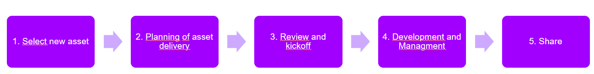

# Asset Creation Guide

1. [#step-1-select-and-discuss-the-idea](asset-creation-guide.md#step-1-select-and-discuss-the-idea "mention")
2. [#step-2-project-planning](asset-creation-guide.md#step-2-project-planning "mention")
3. [#step-3-define-the-tech-stack-and-objectives](asset-creation-guide.md#step-3-define-the-tech-stack-and-objectives "mention")
4. [#steps-4-code-development-and-documentation](asset-creation-guide.md#steps-4-code-development-and-documentation "mention")
5. [#step-5-demo-and-release-preparation](asset-creation-guide.md#step-5-demo-and-release-preparation "mention")


<figure><figcaption></figcaption></figure>


### Step 1:  Select & Discuss the Idea

1. **Objective:** Pick a project idea aligned with existing tech trends or propose a new asset that will benefit your department.
2. **Action Items:**
   * Review the pending asset list or propose your own idea.
   * Discuss the idea with your peers or T\&I team to ensure relevance.
   * Confirm the alignment with capability artifacts or department needs.
3. **Encouragement:** Before moving forward, check with a technical leader for input on your idea. **Early feedback can save time and effort**, so don’t hesitate to reach out for quick validation.
4. **Deliverable:** A clear, documented project idea, ready to move forward.

***

### Step 2: Project Planning

1. **Objective:** Create a detailed project plan to ensure smooth development and timely delivery.
2. **Action Items:**
   * **Define the Project Scope:** Break the project into clear, achievable deliverables (e.g., features or modules).
   * **Define the MVP:** Focus on the smallest, functional piece that can provide value.
     * An MVP should:
       * Solve a problem or provide a basic feature.
       * Be small enough to be built within a few sprints.
       * Be extensible, allowing future enhancements.
   * **Task Breakdown:** Break the project into **small, manageable tasks**, assign estimated story points, and group them into **epics** or **milestones**. Include both development tasks and non-development ones (e.g., documentation, testing).
   *   **Create Tickets:**&#x20;

       * For each task, create tickets in your issue tracking tool (Jira, GitHub Issues). Use the following fields:
         * **Task Title**: Clear and concise name (e.g., "Implement User Authentication").
         * **Description**: A short paragraph describing the task and why it’s necessary.
         * **Definition of Done**: Include acceptance criteria or specific conditions to close the task.
         * **Dependencies**: Specify if the task depends on others.

       **Example:**

       ```
       Task: Implement REST API for User Authentication
       Story Points: 5
       Description: Create an API endpoint that allows users to log in using username and password.
       Definition of Done: API endpoint tested and documented, with authentication handled via JWT.
       Dependencies: Database model for users needs to be set up first.
       ```
3. **Encouragement:** During planning, it’s a good time to **ask a tech leader for advice on feasibility and scope**. You don’t need to wait until the next review meeting!
4. **Deliverable:** A clear roadmap with tasks and tickets.

***

### Step 3: Define the Tech Stack & Objectives

1. **Objective:** Select and document the technologies you’ll use in the project.
2.  **Action Items:**

    * Choose the front-end, back-end, database, and any necessary tools.
    * Write down your choices and explain why they fit your asset's needs.

    **Example:**

    ```markdown
    **Tech Stack:**
    - Front-end: React 18.x - for building the user interface.
    - Back-end: Express.js - to handle API requests.
    - Database: MongoDB - chosen for flexibility in unstructured data storage.
    ```
3. **Encouragement:** Unsure about the tech stack? **Reach out to a technical leader for feedback on your choices**. They can guide you toward the best technologies for scalability and maintainability.
4. **Deliverable:** Documented tech stack in your `README.md` or project overview.

***

### Steps 4: Code, development & documentation

#### A. Code and dev

1. **Objective:** Write clean, modular code that’s easy to maintain and extend.
2. **Action Items:**
   * **Follow Code Standards:** Stick to your department’s code standards (e.g., ESLint for JS, PEP8 for Python).
   * **Commit Often:** Make small, meaningful commits and use descriptive commit messages.
   * **Branching:** Use feature branches with descriptive names (e.g., `feature/login-authentication`).
   * **Pull Requests (PRs):** Submit code via PRs to allow for reviews. Ensure that PRs have descriptions of the changes and tests included.
3. **Encouragement:**&#x20;
   * If you’re unsure about best practices or facing a complex challenge, **don’t hesitate to ask for help**. **Tech leaders are here to support you!** No need to wait for the 2-week meeting—just send a message.
4. **Deliverable:**&#x20;
   * Well-structured code, frequent commits, and regular PRs for review.

B. Documentation

1. **Objective:** Write clear documentation to make the asset easy to understand and use by other developers.
2.  **Action Items:**

    * **Inline Comments:** Use comments sparingly to explain why certain decisions were made.
    * **Function/Method Docs:** Use docstrings (Python, JSDoc for JavaScript) to describe the purpose of each function.

    **Example: Python Docstring:**

    ```python
    pythonCopy codedef authenticate_user(username: str, password: str) -> bool:
        """
        Authenticates a user by verifying their username and password.

        :param username: User's unique identifier
        :param password: User's password
        :return: True if authenticated, False otherwise
        """
        # logic
    ```

    * **API Documentation:** If your asset includes an API, use **Swagger** or **Postman** to document endpoints (request/response formats, status codes, etc.).
3. **Encouragement:**
   * &#x20;If you’re not sure how to document something or need help making it clearer, **ask a tech leader for a review**. Documentation is key to making your asset valuable!
4. **Deliverable:**
   * &#x20;Clear documentation, inline comments, function descriptions, and API documentation (if relevant).

***

### Step 5: Demo,  Release Preparation & Share&#x20;

**Objective:** Prepare to showcase and release your asset.

1. **Action Items:**
   * Schedule a demo with the T\&I team.
   * Create a **final checklist** of all completed tasks.
   * Practice your demo to focus not only on technical details but also **soft skills** like communication and presentation.
2. **Encouragement:**&#x20;
   1. **Tech leaders are happy to help you prepare** for your demo. A quick check-in before presenting can ensure everything runs smoothly.
3. **Deliverable:**&#x20;
   1. A practiced demo and final release, ready to be shared.


Extended exposure --- > resusabiulidad

agregar opciones y contactos


